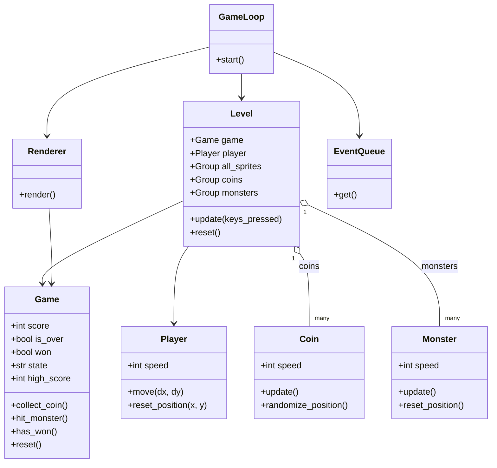

# Pelin luokkakaavio

```mermaid
classDiagram
    class Game {
      +int score
      +bool is_over
      +bool won
      +str state
      +int high_score
      +collect_coin()
      +hit_monster()
      +has_won()
      +reset()
    }

    class Level {
      +Game game
      +Player player
      +Group all_sprites
      +Group coins
      +Group monsters
      +update(keys_pressed)
      +reset()
    }

    class Player {
      +int speed
      +move(dx, dy)
      +reset_position(x, y)
    }

    class Coin {
      +int speed
      +update()
      +randomize_position()
    }

    class Monster {
      +int speed
      +update()
      +reset_position()
    }

    class GameLoop {
      +start()
    }

    class Renderer {
      +render()
    }

    class EventQueue {
      +get()
    }

    Level --> Game
    Level --> Player
    Level "1" o-- "many" Coin : coins
    Level "1" o-- "many" Monster : monsters
    GameLoop --> Level
    GameLoop --> Renderer
    GameLoop --> EventQueue
    Renderer --> Game
```