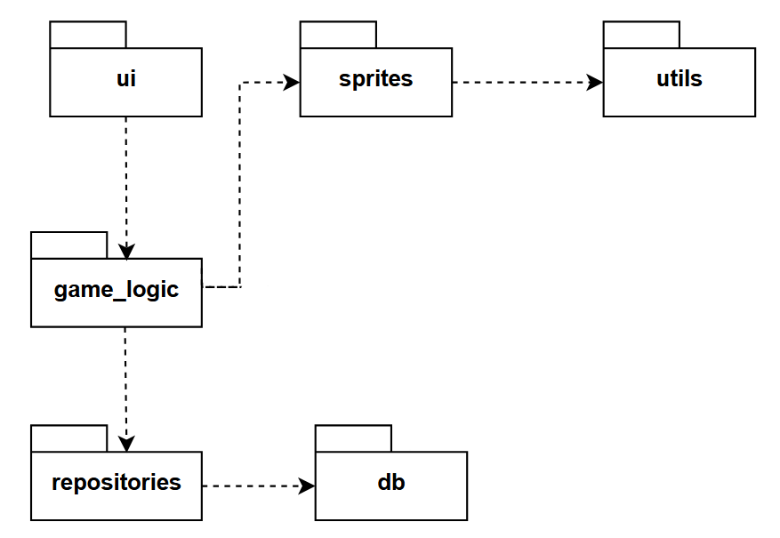
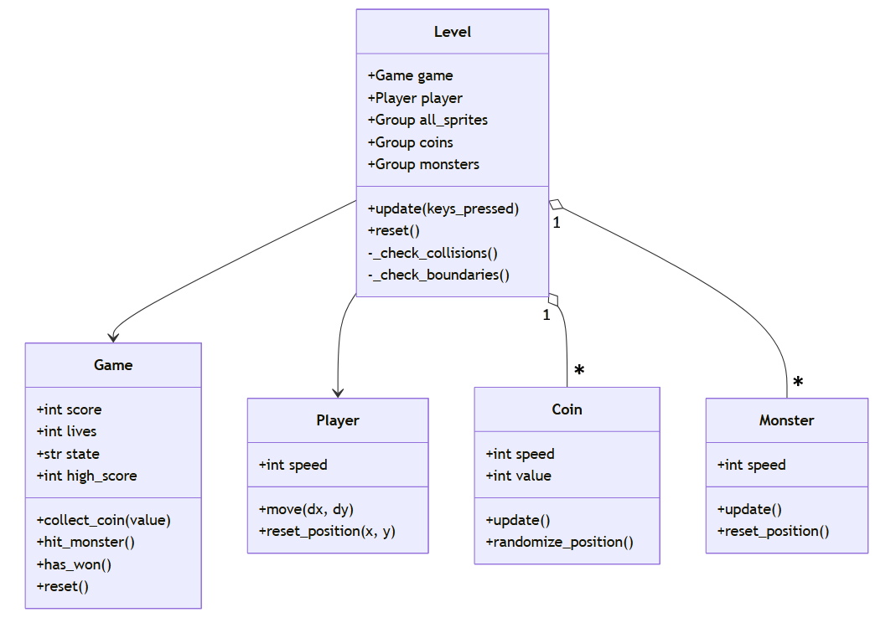
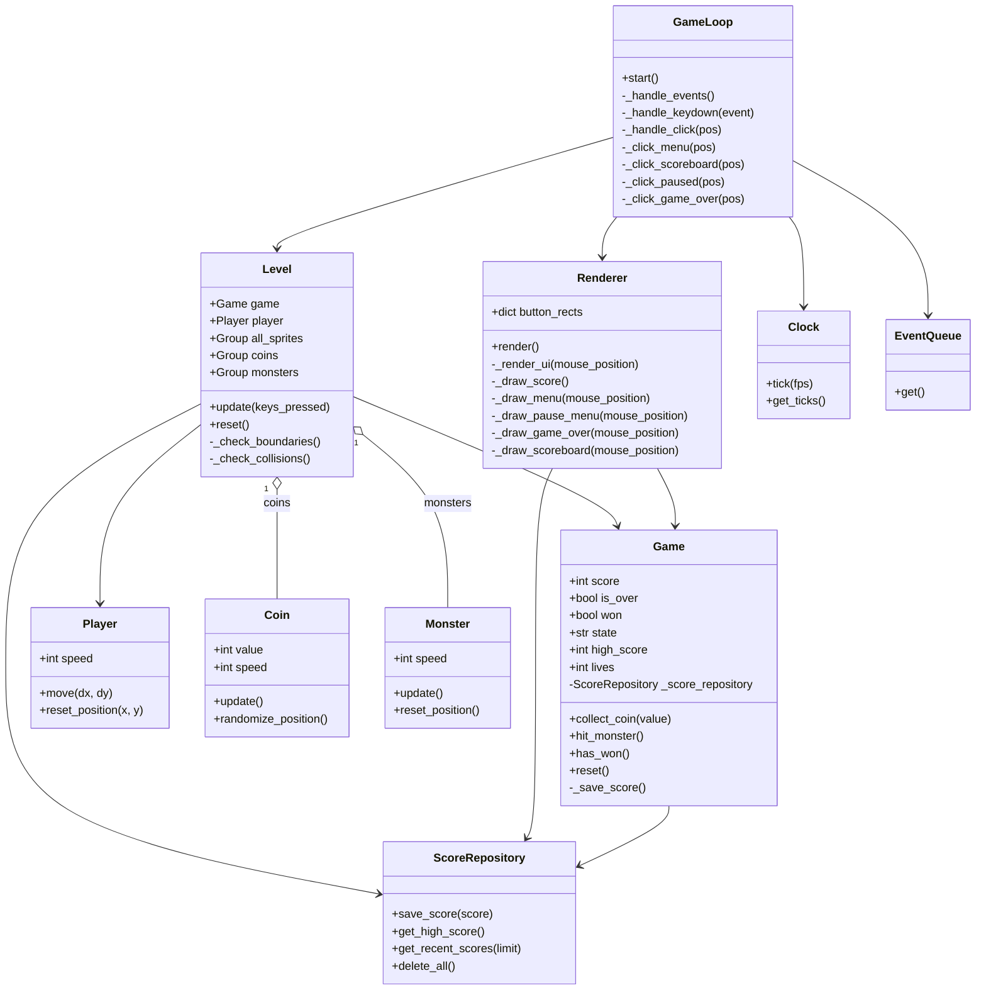
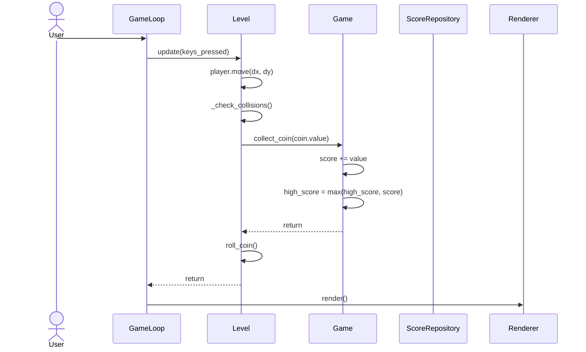
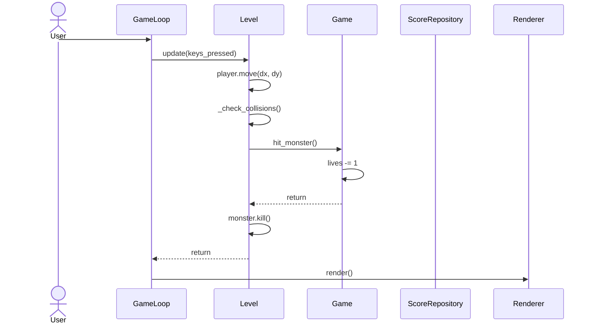
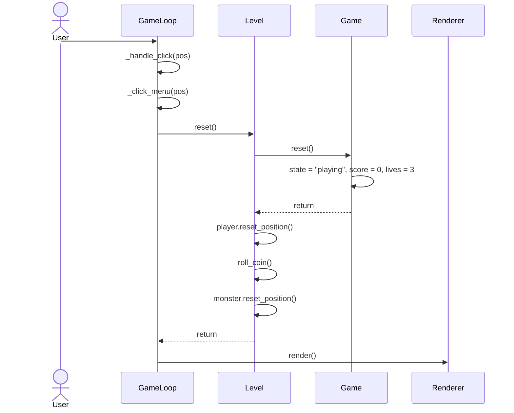

# Arkkitehtuurikuvaus

## Rakenne

Alla näkyy koodin suurpiirteinen pakkausrakenne:

Pakkaus *ui* sisältää käyttöliittymästä eli pelisilmukasta ja piirtämisestä, *repositories* tietojen pysyväistallennuksesta, *sprites* ja *db* tietokannan hallinnasta vastaavan koodin. *game_logic.py* sisältää pelilogiikan ja *level.py* pelin tason objektit sekä törmäystarkistukset.

## Käyttöliittymä

Käyttöliittymä koostuu neljästä eri näkymästä:

- Päävalikko
- Pelinäkymä
- Taukovalikko
- Pelin lopetus
- Tulostaulu

Jokainen näkymä on toteutettu `Renderer`-luokassa omana piirtometodina (`_draw_menu`, `_draw_scoreboard`, `_draw_pause_menu`, `_draw_game_over`). Käyttöliittymä ei vastaa sovelluslogiikasta, vaan ainoastaan nykyisen tilan piirtämisestä.

`Renderer` pitää kirjaa sen hetkisistä napin sijainneista, jota `GameLoop` hyödyntää hiiren klikkauksien käsittelyssä.
 

Pelitilan muutokset tapahtuvat Game-olion state-attribuutin kautta. Mahdolliset tilat ovat "menu", "playing", "paused", "game_over" ja "scoreboard".

## Tietojen pysyväistallennus

`repositories`-pakkauksen `ScoreRepository`-luokka huolehtii tietojen tallentamisesta SQLite-tietokantaan. Luokka noudattaa repositorio-suunnittelumallia.

Pisteet tallennetaan `scores`-tauluun.

### Tiedostot ja konfiguraatio

Tietokantatiedoston nimi haetaan `.env`-tiedostosta ympäristömuuttujalla `DATABASE_FILENAME`. Jos muuttujaa ei ole asetettu, käytetään oletusarvona `database.db`. Testejä varten on erillinen `.env.test`-tiedosto, joka ohjaa testit omaan testitietokantaansa. Tietokantayhteys luodaan `db/database_connection.py`-moduulissa ja sen konfiguraatio sijaitsee `db/config.py`-tiedostossa. Tietokantataulut alustetaan `db/initialize_database.py`-moduulin `initialize_database()`-funktiolla, jota kutsutaan ohjelman käynnistyksen yhteydessä `main.py`:ssä.

## Sovelluslogiikka

Sovelluksen loogisen tietomallin muodostavat luokat `Game`, `Level` ja peliobjektien luokat (`Player`, `Coin`, `Monster`), jotka mallintavat pelin tilaa ja objekteja.

Toiminnallisista kokonaisuuksista vastaa pääosin `Level`-luokan olio, joka hallinnoi kaikkia peliobjekteja ja pelilogiikkaa. `Game`-luokka pitää yllä pelitilaa, jossa on esim pistemäärä ja elämät. Luokalla on pelilogiikan toimintoja:

- `collect_coin(value)` lisää pisteen saldoon kun kolikko kerätään
- `hit_monster()` vähentää elämiä kun hirviö osuu pelaajaan
- `has_won()` tarkistaa voittoehdot

`Level`-luokka hallinnoi `all_sprites`, `coins`, `monsters` ja päivittää pelaajan liikettä, tarkistaa törmäykset ja hallinnoi peliobjektien luomista ja poistamista.

### Pelin luokkakaavio

## Päätoiminnallisuudet

### Kolikon kerääminen

Pelaaja osuu kolikkoon. `GameLoop` kutsuu `Level`-olion `update()`, joka ensin siirtää pelaajaa painettujen näppäinten mukaan ja tarkistaa sitten törmäykset. Törmäyksen havaitessaan `Level` kutsuu `Game`-olion `collect_coin()`, joka kasvattaa pistesaldoa ja päivittää mahd. ennätyksen. Sitten `Level` arpoo kolikolle uuden sijainnin `(roll_coin())`.

### Hirviöön törmääminen

Pelaaja törmää hirviöön. `GameLoop` kutsuu `Level`-olion `update()`, joka siirtää pelaajaa ja tarkistaa törmäykset. Törmäyksen havaitessaan `Level` kutsuu `Game` olion `hit_monster()`, joka vähentää pelaajan elämäpisteitä yhdellä.

### Pelin tilanvaihto

Pelaaja painaa päävalikossa "Start"-nappia. `GameLoop` käsittelee hiiren klikkauksen ja tunnistaa sen. Sitten `GameLoop` kutsuu `Level`-olion `reset()`-metodia, joka ketjuttaa kutsun `Game`-olion `reset()`-metodille.

## Sovelluksen rakenteen mahdolliset laatuongelmat

### Käyttöliittymä

Sovelluksen näytön resoluutio on kovakoodattu eri paikkoihin koodissa.
