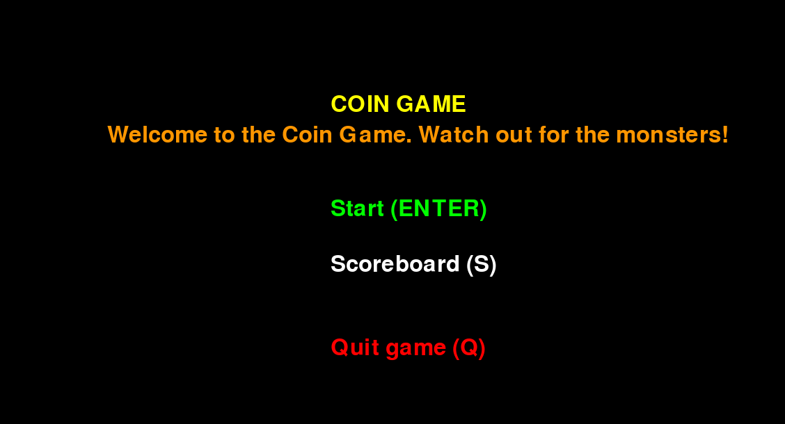
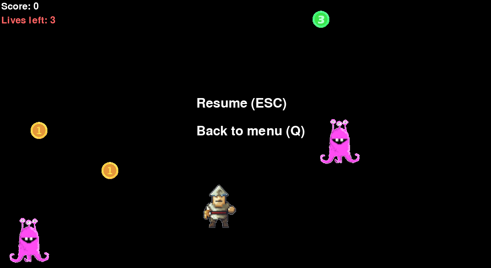

# Käyttöohje

## Etusivu

Kun sovelluksen käynnistää, se aukeaa etusivulle, jossa on kolme toimintoa: 

- Start
- Scoreboard
- Quit game

Pelin aloittaminen onnistuu painamalla "ENTER"-nappia. Tulostaulun tarkastelu tehdään painamalla "S"-nappia, ja sovelluksen sulkeminen tapahtuu "Q"-napista.

## Peli-ikkuna

Kun peli alkaa, pelihahmon liikkumista voi säädellä näppäimistön nuolinäppäimillä. "Esc"-nappia painamalla pääset pause-menuun, jossa voit jatkaa peliä tai sitten lopettaa pelin, jolloin päädyt takaisin etusivulle.
