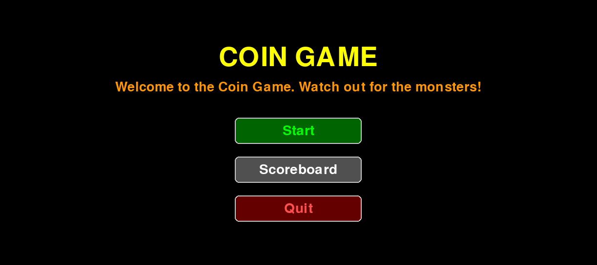
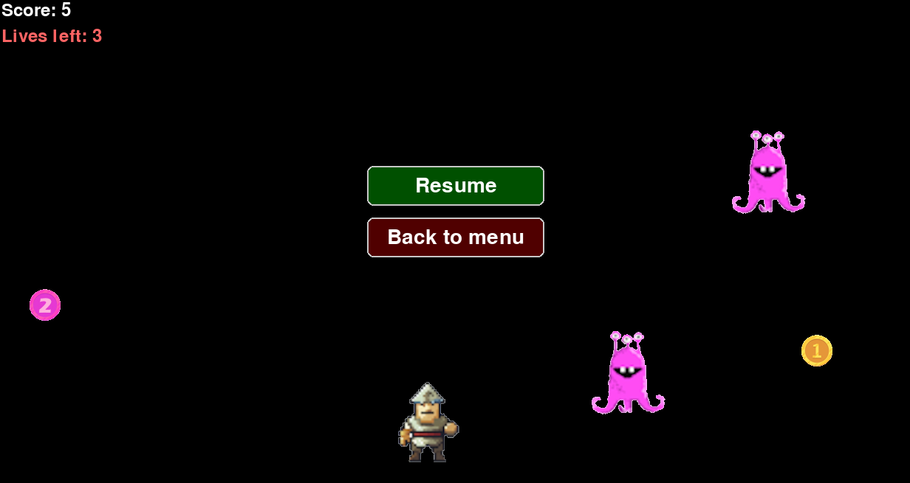

# Käyttöohje

Viimeisimmän version lataaminen projektista onnistuu navigoimalla uusimpaan releaseen ja lataamalla sen lähdekoodi. 

## Sovelluksen konfigurointi

Käyttäjä voi vapaasti muokata tietokannan nimeä haluamakseen `.env` tiedostossa. Tiedostossa on yksi rivi `DATABASE_FILENAME=database.db`, jossa tuon = jälkeen tulevan "database" voi muuttaa minkä vaan nimiseksi.

## Sovelluksen käynnistäminen

Ihan ensin asenna projektin riippuvuudet:

```bash
poetry install
```

Sitten suorita alustustoimenpiteet (tietokanta myös alustetaan automaattisesti sovelluksen käynnistyessä jos käyttäjä unohtaa tehdä tämän vaiheen):
```bash
poetry run invoke build
```

Nyt sovellus käynnistyy komennolla:
```bash
poetry run invoke start
```

## Etusivu

Kun sovelluksen käynnistää, se aukeaa etusivulle, jossa on kolme nappia: 

- Start
- Scoreboard
- Quit game

<p align="center">

</p>

Pelin aloittaminen onnistuu painamalla "Start"-nappia. Tulostaulun tarkastelu tehdään painamalla "Scoreboard"-nappia, ja sovelluksen sulkeminen tapahtuu "Quit game"-napista.

## Peli-ikkuna

<p align="center">

</p>

Kun peli alkaa, pelihahmon liikkumista voi säädellä sekä vaaka että pystysuunnassa näppäimistön nuolinäppäimillä. "Esc"-nappia painamalla pääsee pause-menuun, jossa voi joko jatkaa peliä tai sitten lopettaa pelin, jolloin päätyy takaisin etusivulle. Ikkunan vasemmasta yläreunasta voi seurata elämien ja pisteiden määrää.

- Pelin voittaa, kun kerää vähintään 20 kolikkoa.
- Pelin häviää, jos osuu hirviöön kolme kertaa ja elämäpisteet loppuvat.
