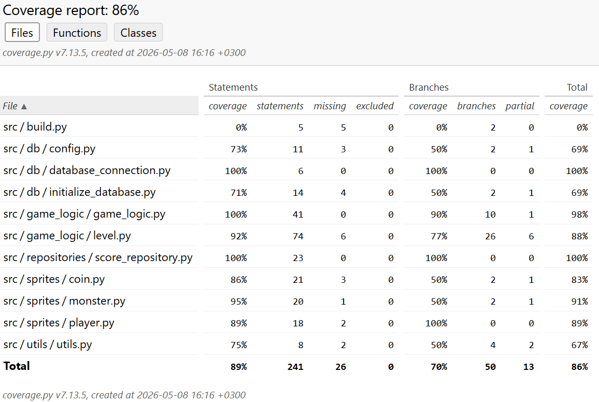

# Testausdokumentti

Ohjelmaa on testattu automatisoiduilla yksikkö- ja integraatiotesteillä unittestiä hyödyntäen sekä järjestelmätason testeillä manuaalisesti.

## Yksikkö- ja integraatiotestaus

### Sovelluslogiikka

`Game` luokan toimintaa testataan `TestGame` testiluokalla. `Game` olio alustetaan testejä varten ilman pysyvää tietokantayhteyttä, jolloin `_save_score()` kutsu käyttää testitietokantaa.

`Level` luokan integraatiota testataan `TestLevel` testiluokalla.

### Repositorio-luokat

Tietokantaoperaatioista vastaavaa repositorio-luokkaa `ScoreRepository` testataan `TestScoreRepository` testiluokalla.

### Testauskattavuus

Testauksessa ei ole otettu huomioon käyttöliittymää. Sovelluksen testikattavuus on 86%.

## Järjestelmätestaus

Sovelluksen järjestelmätestaus tehty manuaalisesti.

### Asennus ja konfigurointi

Sovellus on haettu ja sitä on testattu README.md tiedoston ja käyttöohjeen kuvaamalla tavalla sekä Linux-ympäristöön että yliopiston Cubbli Linux-virtuaalikoneella. Sovellusta on myös testattu tilanteessa, jossa käyttäjä unohtaisi tehdä alustustoimenpiteet komennolla `poetry run invoke build`. Tällöin `database.db` tietokanta luodaan aina automaattisesti.

### Toiminnallisuudet

Kaikki määrittelydokumentissa ja käyttöohjeessa kerrotut toiminnallisuudet on käyty läpi manuaalisesti. Yllättäviä ongelmia tai bugeja ei ilmennyt testauksessa.

## Laatuongelmat

Sovellukseen jää yksi laatuongelma eli Pylintin `inconsistent-return-statements` varoitus.
