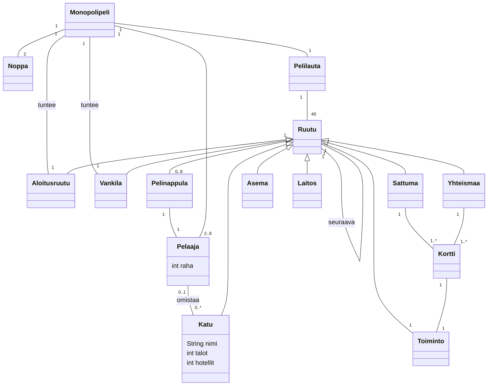

# Monopoli, luokkakaavio

```mermaid
classDiagram
    Monopolipeli "1" -- "2" Noppa
    Monopolipeli "1" -- "1" Pelilauta
    Monopolipeli "1" -- "1" Aloitusruutu : tuntee
    Monopolipeli "1" -- "1" Vankila : tuntee
    Pelilauta "1" -- "40" Ruutu
    Ruutu "1" -- "1" Ruutu : seuraava
    Ruutu "1" -- "0..8" Pelinappula
    Ruutu "1" -- "1" Toiminto
    Pelinappula "1" -- "1" Pelaaja
    Pelaaja "2..8" -- "1" Monopolipeli
    Pelaaja "0..1" -- "0..*" Katu : omistaa
    Sattuma "1" -- "1..*" Kortti
    Yhteismaa "1" -- "1..*" Kortti
    Kortti "1" -- "1" Toiminto
    Ruutu <|-- Aloitusruutu
    Ruutu <|-- Vankila
    Ruutu <|-- Sattuma
    Ruutu <|-- Yhteismaa
    Ruutu <|-- Asema
    Ruutu <|-- Laitos
    Ruutu <|-- Katu
    class Pelaaja {
        int raha
    }
    class Katu {
        String nimi
        int talot
        int hotellit
    }
```